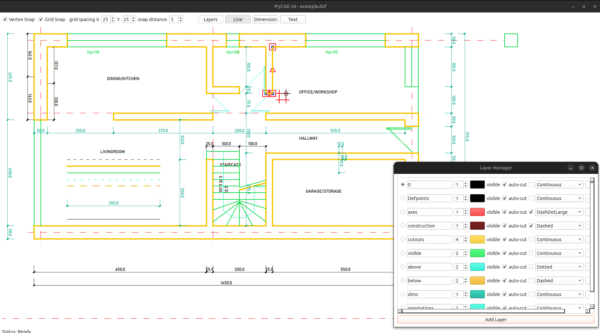

# PyQt Drawing Application Specification

## High-Level Overview

This application is a PyQt-based drawing tool that allows users to draw lines on a canvas. The application supports multiple layers, each with its own properties such as color, line width, and visibility. Users can manage these layers using a non-blocking modal layer manager. Lines drawn on the canvas are stored within the respective layers, and intersections are handled within each layer to split lines at intersection points. The application also provides functionality to add, delete, and manage layers, ensuring that the layers list cannot be empty and the first layer is selected by default.

## Detailed Requirements

### Application Setup
- Implement a PyQt desktop application using PySide6.
- The application should be cross-platform.
- The initial window size should be 800x600.
- The window title should be "PyCAD 14".

### Drawing Canvas
- The main application window should include a drawing canvas for drawing lines, dimensions, and text.
- Lines are drawn by clicking and dragging the mouse.
- The canvas should support zooming in and out centered around the current mouse position using the mouse wheel.
- Line widths and dash patterns should be transformed to model space, adjusting with the zoom.
- The canvas should allow for panning using click and drag.
- The canvas should support grid snapping and vertex snapping.

### Layers
- The application should support multiple layers, each with an associated name, color, line width, linetype, and visibility.
- Layers should support adding lines, rescan for intersections, and cleanup (remove short lines and duplicates).
- The layer list should have a default layer named "Layer-0".
- Provide a UI to manage layers, including creating, deleting, and modifying layers.
- Each layer item in the list should include inputs for name, width, color (color picker), visibility (checkbox), linetype (dropdown), and a remove button.
- Changes to layer properties should be automatically saved on change.
- The selected layer should be indicated with a radio button.
- Ensure the first layer is selected by default at initialization.
- A non-blocking modal should always display the layer manager.
- Layers should be saved/loaded as DXF with layer definitions.
- Read and write linetypes and custom attributes (XDATA) in DXF.

### Line Drawing
- Lines should be drawn with the color and width specified by the current layer.
- Intersections within a layer should split the lines at the intersection points.
- Short lines (length < 1.0) should be automatically removed after drawing.
- Controls and interactions:
  - Left-click and drag to draw a line.
  - Right-click to delete a line.
  - Ctrl+drag to snap the line to 15-degree increments.

### Dimension Drawing
- Dimensions should be constructed the same way as lines.

### Text Drawing
- Text should use the first point as the anchor and the second point to determine the orientation.

### UI Controls
- Toggle Grid Snap (checkbox).
- Toggle Vertex Snap (checkbox).
- Grid spacing (spin boxes for X and Y).
- Snap distance (spin box).
- Buttons for Layer Manager, Line mode, Dimension mode, and Text mode.
- One-line status text at the bottom of the interface.

### Layer Manager
- Non-blocking modal dialog for managing layers.
- **Components**:
  - `layer_list`: QListWidget for displaying layers.
  - `add_layer_button`: QPushButton for adding a new layer.
- **Methods**:
  - `update_layer_list()`: Updates the layer list with current layers, highlighting the selected layer.
  - `add_layer()`: Adds a new layer and updates the list.
  - `remove_layer(layer)`: Removes a layer and updates the list.
  - `on_layer_changed(layer)`: Handles the layer data change.
- Layers saved/loaded as DXF with layer definitions.
- Read and write linetypes and custom attributes (XDATA) in DXF.
- Handle zooming by transforming the current and future matrices, ensuring mouse model coordinates remain consistent.

### Classes

#### LayerModel Class
- **Attributes**:
  - `name`: Name of the layer.
  - `color`: Color of lines in the layer.
  - `width`: Width of lines in the layer.
  - `visible`: Visibility of the layer.
  - `lines`: List of lines in the layer.
  - `flAutoCut`: Boolean flag for auto-cut feature.
  - `linetype`: Linetype of the layer.
- **Methods**:
  - `add_line(line)`: Adds a line to the layer and triggers cleanup.
  - `cleanup()`: Calls `rescan_intersections()`, `remove_short_lines()`, and `cleanup_duplicates()`.
  - `rescan_intersections()`: Detects intersections between lines within the layer, splits lines at intersection points, and updates the lines list.
  - `cleanup_duplicates()`: Removes duplicate lines from the layer.
  - `remove_short_lines()`: Removes lines shorter than a specified threshold from the layer.

#### Line Class
- **Attributes**:
  - `start_point`: Starting point of the line.
  - `end_point`: Ending point of the line.
  - `color`: Color of the line.
  - `width`: Width of the line.
- **Methods**:
  - `contains_point(point)`: Checks if a point is on the line within a margin.
  - `intersect(other)`: Calculates the intersection point with another line if they intersect.
  - `is_short(threshold)`: Checks if the line is shorter than a specified threshold.
  - `__eq__(other)`: Checks if two lines are equal based on their start and end points.
  - `__hash__()`: Generates a hash for the line based on its points.

#### DrawingManager Class
- **Attributes**:
  - `layers`: List of layers in the canvas.
  - `current_layer_index`: Index of the currently selected layer.
  - `current_line`: The line currently being drawn.
  - `zoom_factor`: Zoom factor for the canvas.
  - `offset`: Offset for panning the canvas.
  - `flSnapGrid`: Boolean flag for grid snapping.
  - `gridSpacing`: Grid spacing for snapping.
  - `flSnapPoints`: Boolean flag for vertex snapping.
  - `snapDistance`: Distance for snapping to points.
  - `mode`: Current drawing mode (line, dimension, text).
- **Methods**:
  - `set_mode(mode)`: Sets the current drawing mode.
  - `set_current_layer(index)`: Sets the current layer by index.
  - `add_layer(layer)`: Adds a new layer to the canvas.
  - `remove_layer(index)`: Removes a layer by index, ensuring at least one layer remains.
  - `wheelEvent(event)`: Handles zooming in and out.
  - `map_to_scene(point)`: Maps a point from the view to the scene coordinates.
  - `map_to_view(point)`: Maps a point from the scene to the view coordinates.
  - `apply_mouse_input_modifiers(pos)`: Applies snapping and other modifiers to mouse input.
  - `update_mouse_positions(event)`: Updates mouse positions based on the event.
  - `mousePressEvent(event)`: Starts drawing a line or deletes a line on right-click.
  - `mouseMoveEvent(event)`: Updates the end point of the current line and updates its color and width from the current layer.
  - `mouseReleaseEvent(event)`: Finalizes the current line, adds it to the current layer, and triggers layer cleanup.
  - `paintEvent(event)`: Paints the lines of visible layers and the current line being drawn.
  - `draw_local_grid(painter, center, color)`: Draws a local grid for snapping.
  - `get_all_points()`: Gets all points from all lines in all layers.
  - `get_all_lines()`: Gets all lines from all layers.

#### LayerItem Class
- Custom widget for displaying and editing a layer in the layer manager.
- **Components**:
  - `radio_button`: QRadioButton for selecting the current layer.
  - `name_input`: QLineEdit for editing the layer name.
  - `width_input`: QSpinBox for setting the line width.
  - `color_button`: QPushButton for selecting the layer color.
  - `visibility_checkbox`: QCheckBox for toggling layer visibility.
  - `autocut_checkbox`: QCheckBox for toggling the auto-cut feature.
  - `linetype_combo`: QComboBox for selecting the linetype.
  - `remove_button`: QPushButton for removing the layer.
- **Methods**:
  - `emit_changed()`: Emits the changed signal with the layer data model.
  - `on_radio_button_toggled(checked)`: Updates the current layer when the radio button is toggled.
  - `on_name_changed(text)`: Updates the layer name.
  - `on_width_changed(value)`: Updates the layer width.
  - `on_select_color()`: Opens a color dialog to select the layer color.
  - `on_visibility_changed(state)`: Updates the layer visibility.
  - `on_autocut_changed(state)`: Updates the auto-cut feature.
  - `on_linetype_changed(index)`: Updates the linetype.
  - `on_remove_clicked()`: Triggers the removal of the layer.

#### LayerManager Class
- Non-blocking modal dialog for managing layers.
- **Components**:
  - `layer_list`: QListWidget for displaying layers.
  - `add_layer_button`: QPushButton for adding a new layer.
- **Methods**:
  - `emit_change()`: Emits the changed signal with the layer list.
  - `update_layer_list()`: Updates the layer list with current layers.
  - `add_layer()`: Adds a new layer and updates the list.
  - `remove_layer(layer)`: Removes a layer and updates the list.
  - `on_layer_changed(layer)`: Handles the layer data change.
  - `closeEvent(event)`: Emits the closed signal when the dialog is closed.

#### MainWindow Class
- Main application window.
- **Attributes**:
  - `drawing_manager`: Canvas widget for drawing.
  - `layer_manager`: Non-blocking modal layer manager.
  - `grid_snap_x`: QSpinBox for grid spacing in X direction.
  - `grid_snap_y`: QSpinBox for grid spacing in Y direction.
  - `snap_distance`: QSpinBox for snap distance.
  - `layout_man_button`: QPushButton for showing the layer manager.
  - `line_mode_button`: QPushButton for setting line drawing mode.
  - `dimension_mode_button`: QPushButton for setting dimension drawing mode.
  - `text_mode_button`: QPushButton for setting text drawing mode.
- **Methods**:
  - `init_ui()`: Initializes the UI, sets up the canvas, and shows the layer manager.
  - `set_line_mode()`: Sets the drawing mode to line.
  - `set_dimension_mode()`: Sets the drawing mode to dimension.
  - `set_text_mode()`: Sets the drawing mode to text.
  - `show_layers()`: Shows the layer manager.
  - `on_grid_snap_changed(checked)`: Toggles grid snapping.
  - `on_vertex_snap_changed(checked)`: Toggles vertex snapping.
  - `on_grid_spacing_x_changed(value)`: Updates grid spacing in the X direction.
  - `on_grid_spacing_y_changed(value)`: Updates grid spacing in the Y direction.
  - `on_grid_snap_distance_changed(value)`: Updates the snap distance.
  - `on_layers_changed(layers)`: Handles changes to layers.
  - `on_model_changed(model)`: Handles changes to the drawing model.
  - `on_layer_manager_closed(value)`: Handles the closing of the layer manager.
  - `closeEvent(event)`: Handles the window close event and saves the DXF file.
  - `load_dxf(filename)`: Loads a DXF file and populates the layers and entities.
  - `save_dxf(filename)`: Saves the current drawing to a DXF file.

### Algorithms and Functional Solutions

#### Intersection Handling
- When a new line intersects an existing line, the intersection points are tracked in a table.
- Each line with intersections is grouped, and intersection points are sorted along the line.
- The original line is split at the intersection points, and new segments are created.
- Cleanup operations are performed within each layer to ensure no dependency across layers.
- Self-intersecting lines are handled by:
  - Adding the new line to the model first.
  - Rescanning the entire model for intersections.
  - Putting each intersection in a table tracking the targeted line and the intersection point.
  - Grouping the table by line ID, getting an associated list of split points.
  - Projecting the intersection points onto the target line, ordering them on the local line coordinates, generating the segments by successive pairs of points, deleting the original segment, and adding the new segments.

#### Zooming About Point
- Get the current mouse position in screen coordinates.
- Compute the current mouse position in model coordinates using the current matrix.
- Scale the matrix according to the zoom.
- Translate the zoomed matrix so that the screen coordinates of the mouse model coordinates are the same as calculated in the first step.

#### Non-Blocking Modal for Layer Manager
- The layer manager is implemented as a QDialog and shown using show(), ensuring it does not block interaction with the main window.

#### Selected Layer Marker
- The selected layer in the layer manager is highlighted with a radio button.

#### Dynamic Line Properties
- During drawing, the line's color and width are continuously updated to match the current layer's properties, ensuring consistency even when the layer properties change mid-draw.
